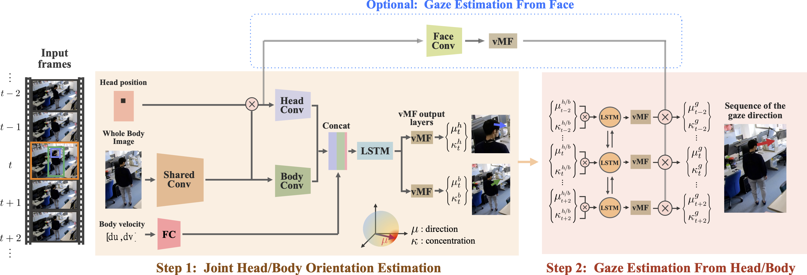
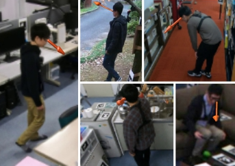

# Dynamic 3D Gaze from Afar: Deep Gaze Estimation from Temporal Eye-Head-Body Coordination, CVPR 2022

This repository provides an inplementation of our paper [Dynamic 3D Gaze from Afar: Deep Gaze Estimation from Temporal Eye-Head-Body Coordination]() in CVPR 2022. If you find our work useful in your research please consider citing our paper.

Please note that this is research software and may contain bugs or other issues – please use it at your own risk. If you experience major problems with it, you may contact us, but please note that we do not have the resources to deal with all issues.

```
@InProceedings{Nonaka_2022_CVPR,
    author    = {Nonaka, Soma and Nobuhara, Shohei and Nishino, Ko},
    title     = {Dynamic 3D Gaze from Afar: Deep Gaze Estimation from Temporal Eye-Head-Body Coordination},
    booktitle = {Proceedings of the IEEE/CVF Conference on Computer Vision and Pattern Recognition (CVPR)},
    month     = {June},
    year      = {2022},
    pages     = {}
}
```



## Prerequisites

We tested our code with Python 3.7 on Ubuntu 20.04 LTS. Our code depends on the following modules.
* numpy
* opencv_python
* matplotlib
* tqdm
* pytorch
* torchvision
* pytorch_lightning
* efficientnet_pytorch
* albumentations

Please browse [`conda.yaml`](conda.yaml) to find the specific versions we used in our test environment, or you can simply do
```
$ conda env create --file conda.yaml
```
in your (virtual) environment.

Alternatively, you can use [`gafa.def`](singularity/gafa.def) to build your [`singularity`](https://sylabs.io/) container by
```
$ singularity build --fakeroot ./singularity/gafa.sif ./singularity/gafa.def
INFO:    Starting build...
Getting image source signatures
(snip)
INFO:    Creating SIF file...
INFO:    Build complete: ./gafa.sif
```
The file size of the generated container file (`gafa.sif` in this example) will be around 7.7GB.


## Gaze from Afar (GAFA) dataset



### Download 

We provide the raw data and preprocessed data. **As the raw data is so large (1.7 TB), we recommend you to use the preprocessed data (5.9 GB), which contain cropped human images.** If you would like to use your own cropping or head detection models, please use the raw data. 
   - Preprocessed data: [Download all sequence (5.9GB)](https://drive.google.com/file/d/1ef8uKVlq4jLKGZ2gVLDwHx6u0HayPTZf/view?usp=sharing)
   - Raw data: [Library (926GB)](https://drive.google.com/file/d/1Q3Y5EVRKpulOYTXGlh0M5KrMhAjHvVb8/view?usp=sharing), [Lab (112GB)](https://drive.google.com/file/d/1Q3RK2A9RS8e1N9zbGWmSfqYeBemH0g_P/view?usp=sharing), [Kitchen (132GB)](https://drive.google.com/file/d/1Uzt5X42UkWTX78OtGX06s_wRNAW9XinP/view?usp=sharing), [Courtyard (436GB)](https://drive.google.com/file/d/13cvbBbaTEGrlQlBGYI7XJ5A6h6S7e9ug/view?usp=sharing), [Living room (35GB)](https://drive.google.com/file/d/1uZYt4_GOKdsZrEcemoXjLlnDS6IWINl5/view?usp=sharing) 

### Raw data

We provide the raw surveillance videos, calibration data (camera intrinsics and extrainsics), and annotation data (gaze/head/body directions). Our dataset contains 5 daily scenes, *lab, library, kitchen, courtyard, and living room*. 

The data is organized as follows. 

```
data/raw_data
├── library/
│   ├──1026_3/
│   │   ├── Camera1_0/
│   │   │   ├── 000000.jpg
│   │   │   ├── 000001.jpg
│   │   │    ...
│   │   ├── Camera1_0.pkl
│   │    ...
│   │   ├── Camera1_1/
│   │   ├── Camera1_1.pkl
│   │    ...
│   │   ├── Camera2_0/
│   │   ├── Camera2_0.pkl
│   │    ...
│   ├──1028_2/
│   ...
├── lab/
├── courtyard/
├── living_room/
└── kitchen/
```

Data is stored in five scenes (e.g. `library/`). 
- Each scene is subdivided by shooting session (e.g. `1026_3/`). 
- Each session is stored frame by frame with images taken from each camera (e.g. `Camera1_0, Camera2_0, ..., Caemra8_0`). 
   - For example, `Camera1_0/000000.jpg` and `Camera2_0/000000.jpg` contain images of a person as seen from each camera at the same time.
   - In some cases, we further divided the session into multiple subsessions (e.g. `Camera1_1, Camera1_2, ...`)
- The calibration data of each camera and annotation data (gaze, head, and body directions) in the camera coordinate are stored in a pickle file (e.g. `Caera1_0.pkl`).


### Preprocessed data

The preprocessed data are stored in a similar format as the raw data, but each frame contains cropped person images. 

We also provide a script to preprocess raw data as [data/preprocessed/preprocess.py](data/preprocessed/preprocess.py). 


## Usage

### Demo 

Please open the following Jupyter notebooks.
* [`demo.ipynb`](demo.ipynb): Demo code for end-to-end gaze estimation with our proposed model. 
* [`dataset-demo.ipynb`](./data/dataset-demo.ipynb): Demo code to visualize annotations of the GAFA dataset. 

In case you have built your singularity container as mentioned above, you can launch `jupyter` in `singularity` by
```
$ singularity exec ./singularity/gafa.sif jupyter notebook --port 12345
    To access the notebook, open this file in a browser:
        file:/// ...
    Or copy and paste one of these URLs:
        http://localhost:12345/?token= ...
     or http://127.0.0.1:12345/?token= ...
```

Or, you can launch bash shell in `singularity` by
```
singularity shell --nv ./singularity/gafa.sif --port 12345
```

### Evaluation with the GAFA dataset

Please download the weights of the pretrained models from [here](), and place the `.pth` files to `models/weights`. 

We can then evaluate the accuracy of the estimated gaze direction with our model. 
```
python eval.py \
   -- gpus 1 (If no GPU is available, set -1) \

# Result
MAE (3D front):  20.697409
MAE (2D front):  17.393957
MAE (3D back):  23.210892
MAE (2D back):  21.901659
MAE (3D all):  21.688675
MAE (2D all):  20.889896
```

### Training with the GAFA dataset

You can train our model with the GAFA dataset by
```
python train.py \
   --epoch 10 \
   --n_frames 7 \
   --gpus 2 
```

It will consume 24GB for each GPUs, and takes about 24 hours for training. As we implement our model using `distributed data parallel` functionality in PyTorch Lightning, you can speed up the training by adding more GPUs. 

If your GPU's VRAM is less than 24 GB, please switch the model to `data parallel` mode by changing `strategy="ddp"` in `train.py` to `strategy="dp"`. 
